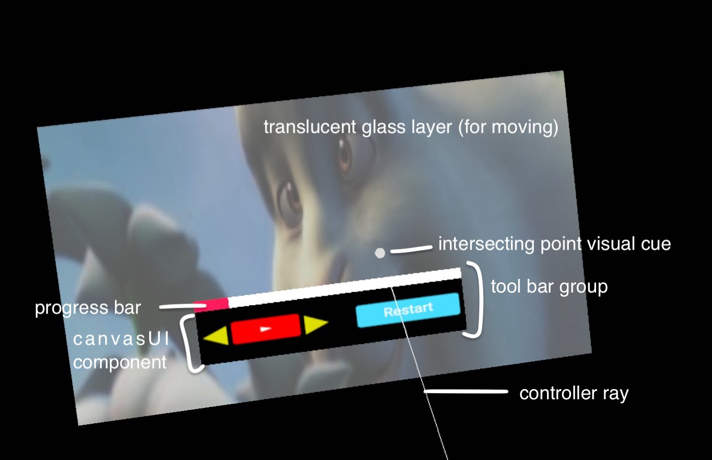
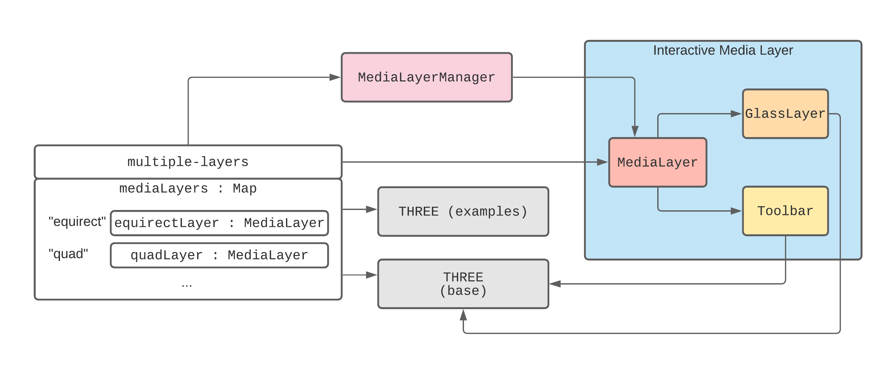
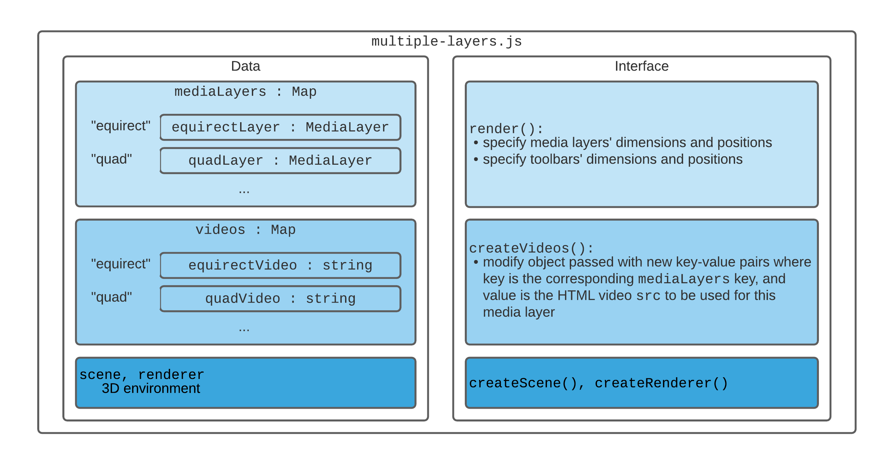
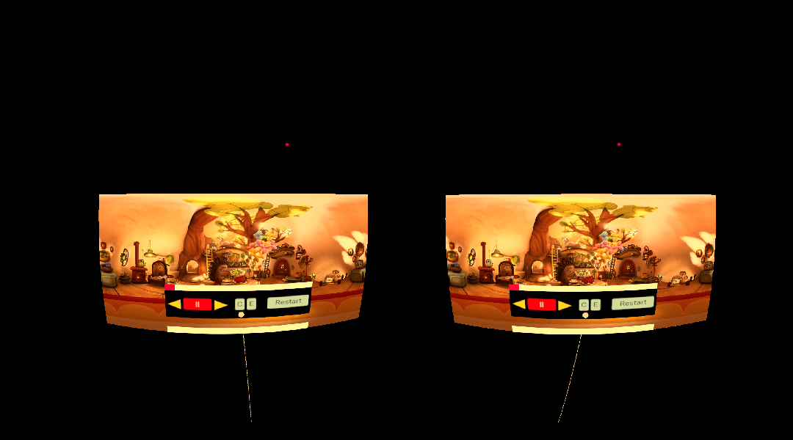

This project is a product of an [Major League Hacking (MLH) Spring 2021 Fellowship](https://fellowship.mlh.io/) open source contribution!

[Composition of WebXR layers](https://www.w3.org/TR/webxrlayers-1/#intro) has significant benefits. This application is a small collection of samples that demonstrate creating and interacting with video layers in an XR environment. Because video layers cannot be interacted with directly via a controller, a 3D rendering library is used to achieve the desired interactions, including video playback controls, and moving and resizing layers. For this project, we chose to use [Three.js](https://threejs.org/) as our main 3D rendering library.

## Media

[Featured](https://www.linkedin.com/posts/major-league-hacking_webxr-a-contributors-story-with-zhixiang-activity-6785235305592066048-JaQ6) by Facebook and Major League Hacking for my contribution to the WebXR project!

## Contribution

Kickstarted [open source scene](https://github.com/und3fined-v01d/webxr-layers/pull/39) for WebXR and WebXR layers.

## Design

Overview and minimal viable product:

## Application Architecture

### General

For in-depth discussion, see [here](https://github.com/und3fined-v01d/webxr-layers/tree/docs#application-architecture).

### User Interface

## Features

### Toolbar Interactions

Four main playback controls:

1. Play / Pause
2. Rewind 15s Backwards / Skip 15s Forwards
3. Restart
4. Progress Bar Point Select

### Moving Video Layers

### Resizing Video Layers

