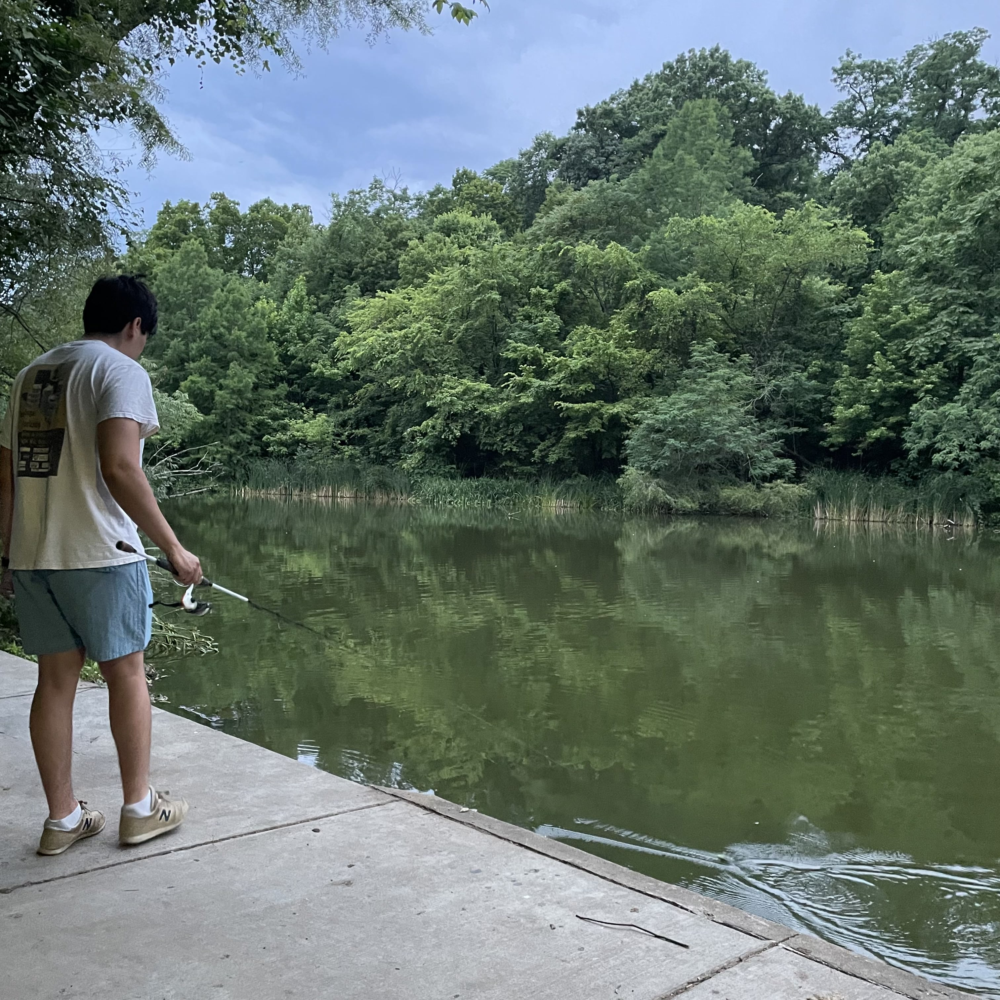

**Check out my first [publication](https://joss.theoj.org)!**

Thanks for looking at my personal website! I am an undergraduate [Computer Science](https://ceas.uc.edu/academics/departments/computer-science.html) student studying at the University of Cincinnati. 

Most recently, I was a software engineer intern at [Netflix](https://www.netflix.com/) in Los Gatos, CA, where I worked on the Testing, Integration, and Productivity team (formerly known as Mobile Productivity). I worked on improving the visiblity into Netflix's device testing labs.

I am interested in distributed systems, backend development, and machine learning. Lately, I have been [reading](https://understandingdistributed.systems) and working on AI systems for tabular data.

Outside of class, I enjoy listening to live music, fishing, and playing basketball.

My favorite quote:

> Sometimes it’s the people no one imagines anything of who do the things that no one can imagine.
