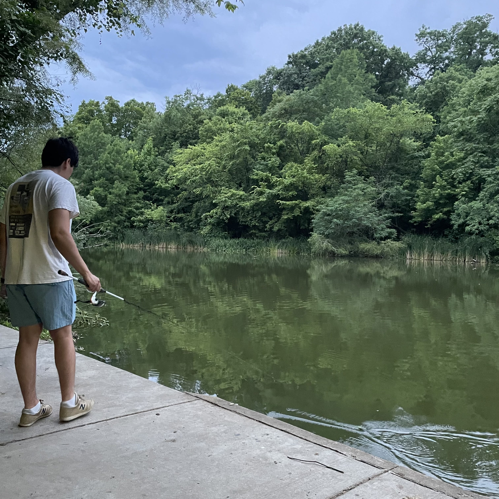

**Check out my first [publication](https://joss.theoj.org)!**

Thanks for stopping by! I'm a CS student at the University of Cincinnati, graduating May 2027.

Most recently, I interned at Google in Seattle working on Gemini AI for Google Cloud Storage — specifically building agents. Before that, I was back at Netflix for a second summer building an AI agent to diagnose CI/CD failures and a tool to isolate test-breaking PRs in batched merges across iOS and Android.

Outside of work, I enjoy playing guitar, basketball, and fishing.

My favorite quote:

> Sometimes it's the people no one imagines anything of who do the things that no one can imagine.
